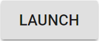
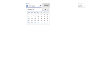
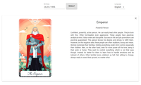
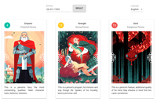

<h1 align="center">Arcane</h1>

<div align="center">
  <sub>What's that?! A mysterious yet awesome project?! Again?! How sudden!</sub>
</div>

<br/>


<div align="center">
  <a href="https://dmitry-white.github.io/Arcane/"></a>
</div>

## Description
<div align="center">
  Lorem ipsum temp short thingy
  <br/>
  <br/>
  
  
  
</div>

## Story
Lorem ipsum temp full thingy
                            
### Local Usage
```
npm install
npm start
```

## Inspiration
* [Me](https://github.com/Dmitry-White) - Great projects, simply great.
* [Myself](https://github.com/Dmitry-White) - They are, trust me.
* [I](https://github.com/Dmitry-White) - These two awesome professionals above have rather valid points. Nothing to add, really. Except for one thing - a star to every project! Because they're awesome! Hooray!

## License
This project is licensed under the MIT License


